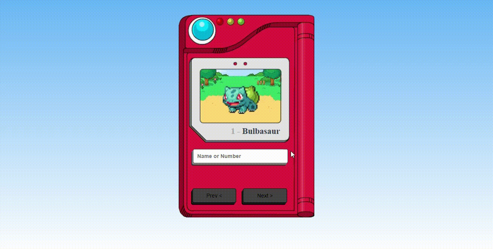

# Pokedex

  

## Table of contents
* [General info](#general-info)
* [Technologies](#technologies)
* [Commands](#commands)

## General info
Para os amantes de Pokémons uma Pokedex animada !

## Technologies
* JavaScript;
* HTML;
* CSS;

## Commands

Runs the app in the development mode. 
Open [Pokedex](https://kerlleyp.github.io/Pokedex/) 🎮 to view it in the browser.

The page will reload if you make edits. 
You will also see any lint errors in the console.
